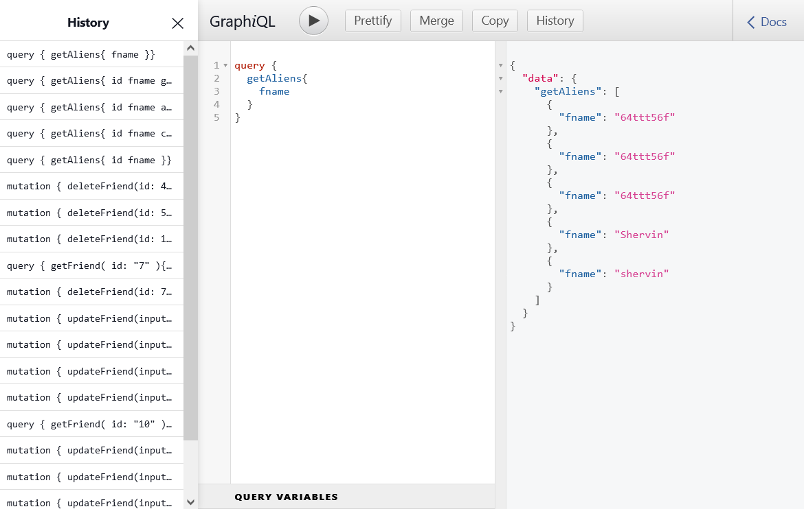
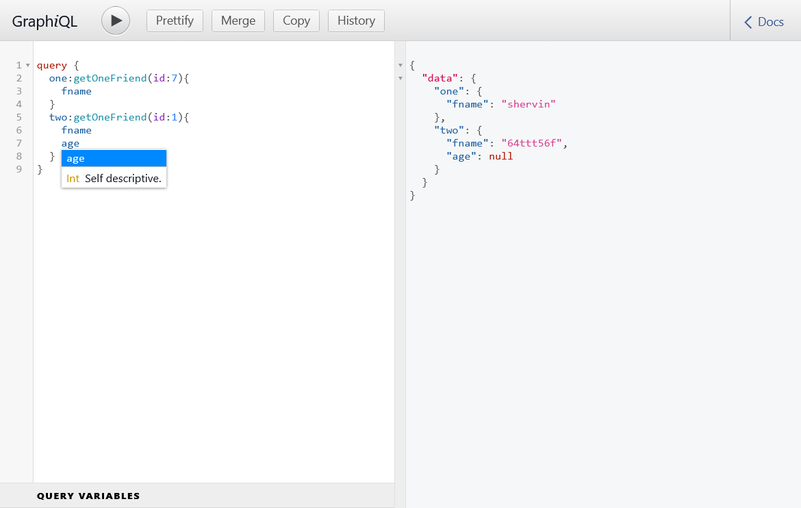
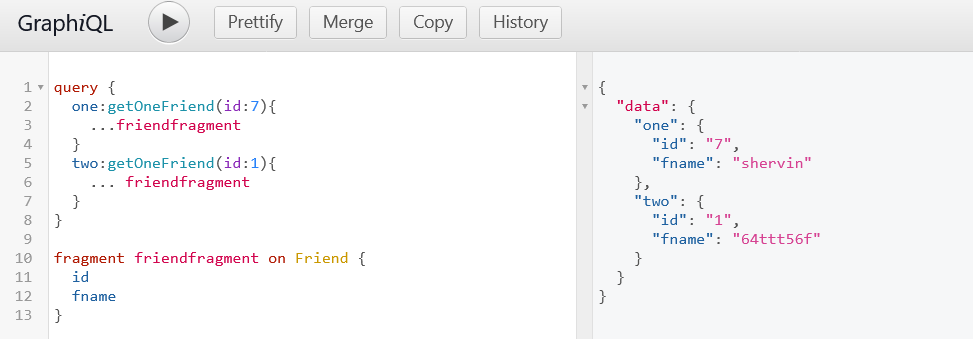
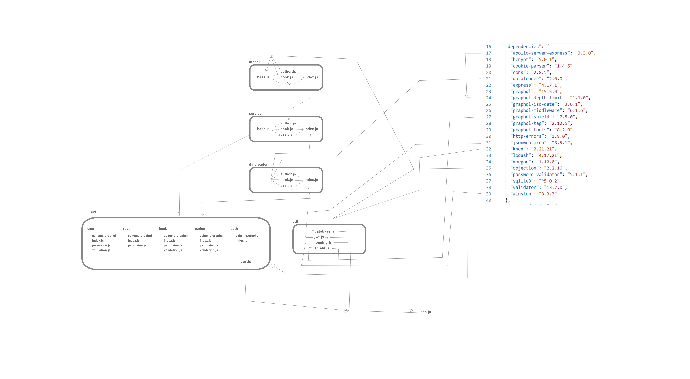

<<<<<<< HEAD
# GraphQL (v1.5)
2022.03.30 - only backend with postman

## this branch (v1.5) 
   
Sample project demonstrating common issues to consider when working on GraphQL API

[Article](https://www.toptal.com/graphql/creating-your-first-graphql-api)
=======
# GraphQL (v1.4)
2022.04.02

## this branch (v1.4) 
  
CRUD GraphQL finished!
 
## final shots

0
 


1



2



3


>>>>>>> v1.6

## overview 




## postman

```
query {
   authors {
      id, fullName
      books {
         id, title 
      }
   }
}
```

# Used Core Libraries

- [graphql-js](https://github.com/graphql/graphql-js)
- [apollo-server](https://github.com/apollographql/apollo-server)
- [graphql-tools](https://github.com/apollographql/graphql-tools)
- [graphql-middleware](https://github.com/prisma/graphql-middleware)
- [objection-js](https://github.com/vincit/objection.js)
- [jest](https://github.com/facebook/jest)

# Project Demonstrates

<<<<<<< HEAD
- GraphQL Server Setup
- Advanced Scalar Data Types
- Splitting Schema
- Authentication and Authorization
- Validation
- N + 1 Queries
- Security
- Integration Testing

 
=======
>>>>>>> v1.6
