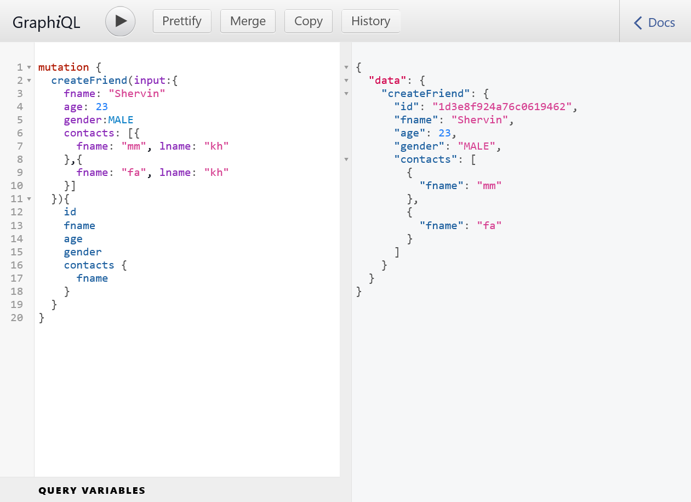

# GraphQL (v1.4)
2022.03.27

## this branch (v1.4) 
  

graphql syntax is similar to typescript syntax

### video numbers

12. `age: Int`
13. `enum Gender { `

14. add contact field

```
type Query {
type Mutation {

type Friend { age: Int String [Contact] [Contact]!
input FriendInput { Contacs: [ContactInput]

type Contact { 
input ContactInput {
```

## result in browser


