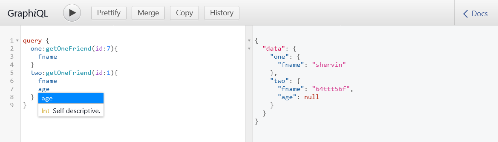

# GraphQL (v1.4)
2022.04.02

## this branch (v1.4) 
  
CRUD GraphQL finished!
 
## final shots

0
 

1

2

3

 

  
 ## Error

`yarn global add babel-cli `

if you installed `babel-cli` as dependency, remove and install it after global installation!